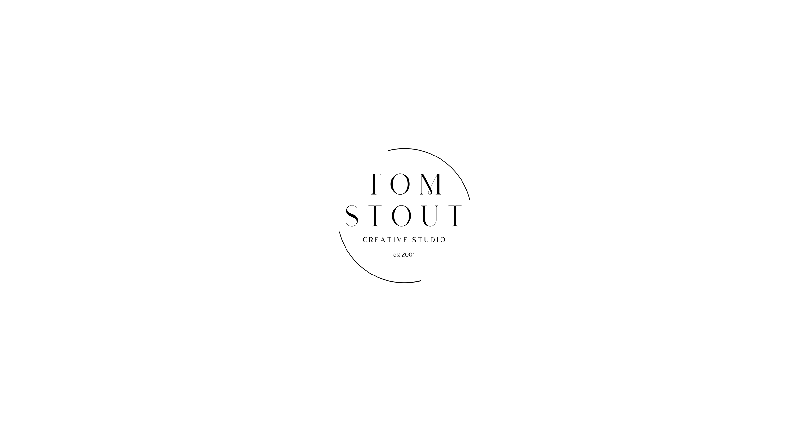
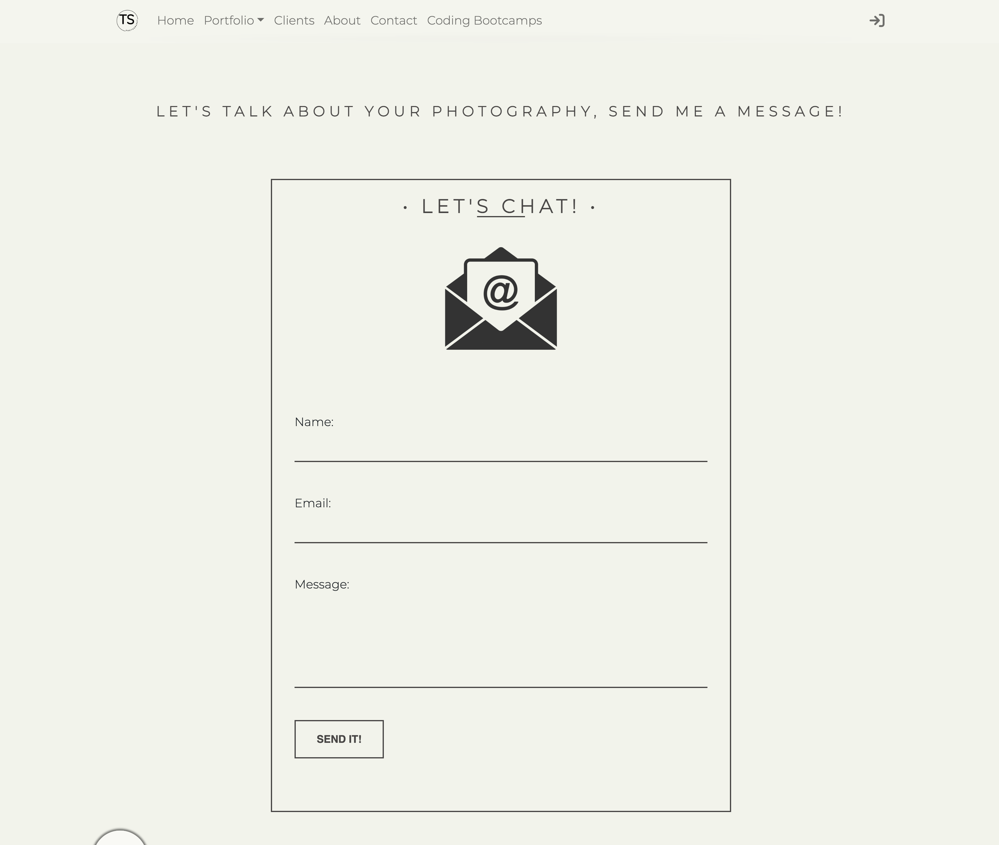

<h1 align="center">Tom Stout Photography</h1>

<h4 align="center">Website and Studio Management Application </h4>

> This project is a website and studio management application built using Python, Django and PostgreSQL.

## Technology Stack:

> 

  

___

### Website:
1. Homepage with parallax scrolling effect
2. Image gallery with lightbox view
3. Client and Portfolio Galleries
4. Contact Page with email        
5. Drone Portfolio page with video background

___

## Database includes:
-   User tables for login and authentication
-   Contact messages
-   Clients
-   Sessions
-   Financial Records  

___

<h1 align="center">Links</h1>

* GitHub Link:  https://github.com/Tom-Stout325/tsp.git

___

<h1 align="center">Screenshots</h1>

> 

